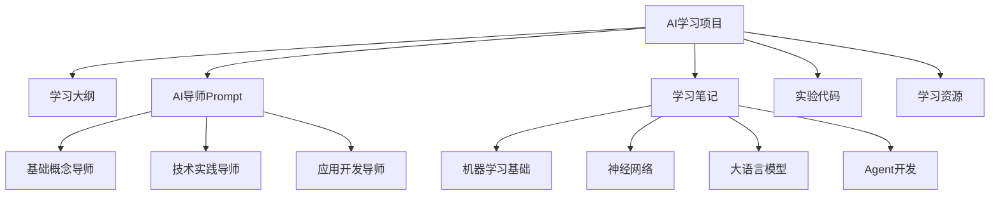

## 用户需求

用户希望将此项目作为学习 AI 相关技术的个人学习项目，需要：

1. **AI 专家 Agent Prompt**：创建一个全方位的 AI 导师 Prompt，能够教授最新的 AI 知识
2. **AI 小白学习大纲**：设计一个面向初学者的学习路径，重点关注 LLM 应用原理而非基础设施开发

## 产品概述

这是一个结构化的 AI 学习项目，包含学习大纲、AI 导师 Prompt、分阶段笔记目录和实验代码空间，帮助用户从零基础系统学习 AI 技术。

## 核心功能

- 提供专业的 AI 导师 Prompt 用于学习指导
- 构建完整的学习大纲和路径规划
- 创建分模块的笔记和资源管理系统
- 支持实验代码和学习进度跟踪

## 技术栈选择

- **文档格式**：Markdown - 便于阅读和版本控制
- **项目结构**：分层目录组织 - 按学习阶段和内容类型划分
- **版本控制**：Git - 跟踪学习进度和笔记变更

## 实施方案

采用**渐进式学习架构**，将复杂的 AI 知识体系分解为四个递进阶段：

1. **机器学习基础** - 建立核心概念认知
2. **神经网络** - 理解深度学习原理  
3. **大语言模型** - 掌握 LLM 工作机制
4. **Agent 开发** - 学习实际应用开发

每个阶段包含理论学习、实践练习和进度跟踪，确保学习效果。

## 实施细节

- **学习路径设计**：基于认知负荷理论，从简单概念逐步过渡到复杂应用
- **Prompt 工程**：设计多角色 AI 导师，包含不同专业领域的教学能力
- **知识管理**：采用结构化笔记模板，便于知识整理和回顾

## 架构设计

### 项目架构



## 目录结构

```
我要学AI/
├── README.md                    # [MODIFY] 项目总览和使用指南
├── 学习大纲.md                   # [NEW] 完整的学习路径规划，包含4个阶段的详细内容和时间安排
├── prompts/                     # [NEW] AI导师Prompt目录
│   ├── ai-tutor.md             # [NEW] 主要的AI导师Prompt，包含多角色教学能力
│   ├── ml-basics-tutor.md      # [NEW] 机器学习基础专项导师
│   ├── llm-expert.md           # [NEW] 大语言模型专家导师
│   └── agent-developer.md      # [NEW] Agent开发实践导师
├── notes/                       # [NEW] 学习笔记目录
│   ├── 01-机器学习基础/         # [NEW] 第一阶段笔记目录，包含概念、算法、实践三个子目录
│   ├── 02-神经网络/             # [NEW] 第二阶段笔记目录，包含原理、架构、训练三个子目录  
│   ├── 03-大语言模型/           # [NEW] 第三阶段笔记目录，包含原理、应用、优化三个子目录
│   └── 04-Agent开发/            # [NEW] 第四阶段笔记目录，包含设计、开发、部署三个子目录
├── playground/                  # [NEW] 实验代码目录
│   └── README.md               # [NEW] 实验代码使用说明
└── resources/                   # [NEW] 学习资源收集目录
    ├── books.md                # [NEW] 推荐书籍清单
    ├── papers.md               # [NEW] 重要论文收集
    ├── tools.md                # [NEW] 实用工具推荐
    └── websites.md             # [NEW] 学习网站收集
```

## 关键代码结构

### AI导师Prompt结构

```markdown
# AI导师角色定义
- 基础概念解释者：用通俗易懂的语言解释复杂概念
- 实践指导者：提供具体的学习方法和练习建议  
- 进度跟踪者：帮助制定学习计划和检查学习效果
- 问题解答者：针对学习中的疑问提供详细解答
```

## Agent Extensions

### Skill

- **skill-creator**
- 目的：创建专业的AI导师技能，增强教学指导能力
- 预期结果：生成定制化的AI导师Prompt，具备分阶段教学和个性化指导功能