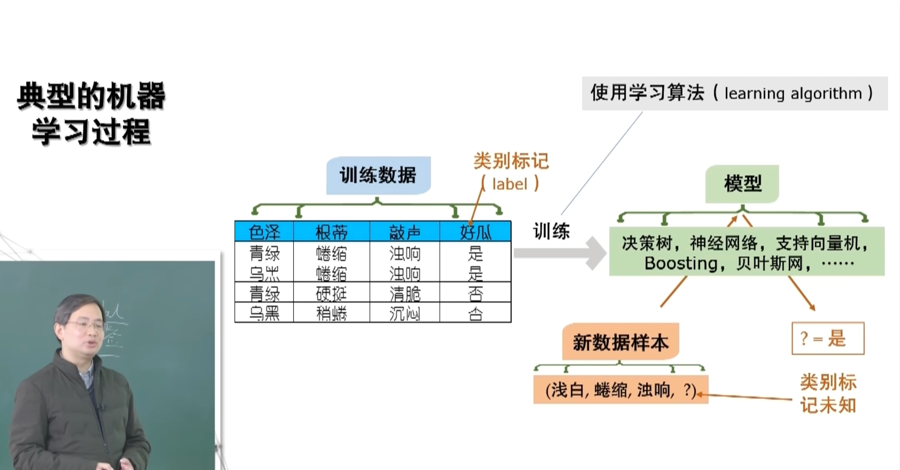
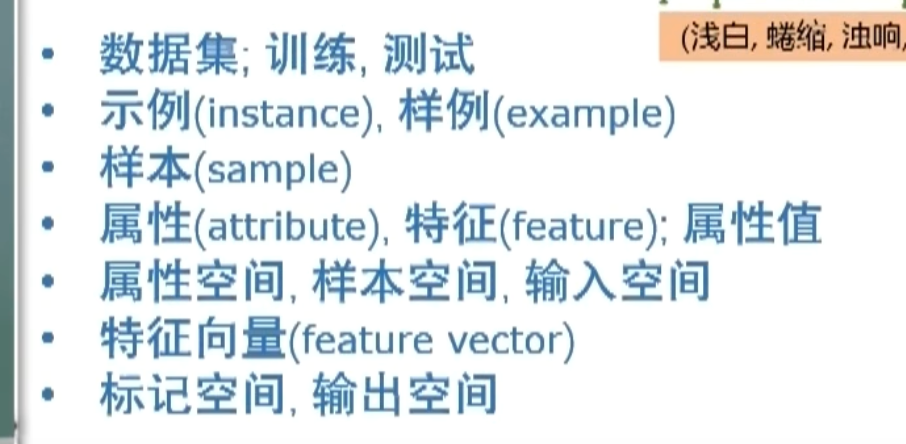
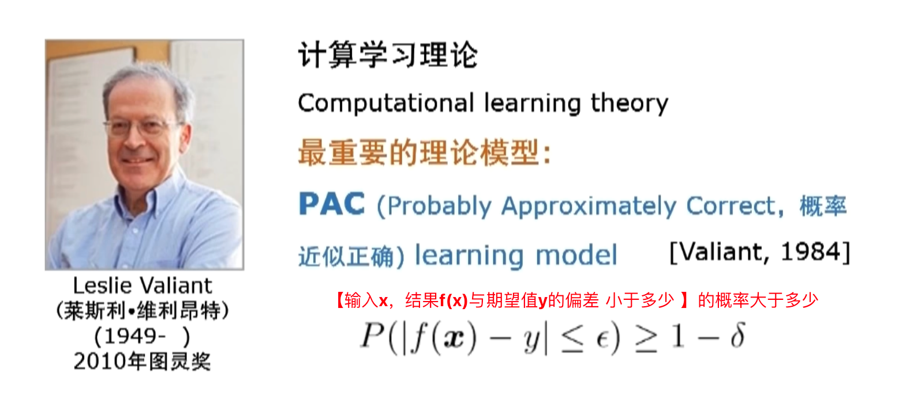

# 机器学习笔记

## 前言
主要是由西瓜书的机器学习笔记组成。
https://www.bilibili.com/video/BV1gG411f7zX/
[西瓜书](../books/Machine-Learning%20《机器学习（西瓜书）》_周志华.pdf)

1. 看书第一遍要快速看完，大概知道有哪些知识。 一个月内

典型的机器学习过程

基本术语：

label 标签 标记
模型model适用于全局，模式pattern适用于局部

PAC：Probably Approximately Correct 概率近似正确
   
机器学习——以很高概率得到一个很好的模型

## 第4章 决策树

### 核心思想
决策树 = 选属性 + 分裂 + 剪枝。通过对属性逐步划分，把特征空间切成一块块区域，每块对应一个预测值。

### 结构三要素
- **内部节点**：一个属性上的测试（色泽？声音？）
- **分支**：测试的结果（青绿、乌黑...）
- **叶节点**：最终预测（好瓜/坏瓜）

### 划分选择——选哪个属性先分？

核心目标：每次划分后，子集越"纯"越好。

**1. 信息熵 Entropy** —— 衡量不确定性
- Ent(D) = -Σp_k·log₂(p_k)
- 全纯（全是好瓜）→ 熵=0；一半一半 → 熵=1（最大）
- 熵越大 → 越混乱 → 越不纯

**2. 信息增益**（ID3算法）
- Gain(D,a) = Ent(D) - Σ(|Dv|/|D|)·Ent(Dv)
- 划分前后熵的差值，越大说明划分效果越好
- ⚠️ 偏爱多值属性（如"编号"，每个分支只有1个样本，熵=0，但完全过拟合）

**3. 增益率**（C4.5算法）
- Gain_ratio(D,a) = Gain(D,a) / IV(a)
- IV(a)是固有值，取值越多越大，作为分母惩罚多值属性
- 类比：100道题得95分 vs 3道题得3分，除以题目数才公平

**4. 基尼指数**（CART算法）
- Gini(D) = 1 - Σp_k²
- 随机抽两个样本类别不同的概率，越小越纯

| 算法 | 划分标准 | 特点 |
|------|---------|------|
| ID3 | 信息增益 | 偏爱多值属性 |
| C4.5 | 增益率 | 修正了多值偏好 |
| CART | 基尼指数 | 二叉树，计算简单 |

### 剪枝——决策树靠什么缓解过拟合？

**预剪枝**：边长边剪。每次分裂前问"在验证集上能变好吗？"不能就不分。
- 优点：快，树小
- 缺点：可能剪早（有些当前没用但后续有用的分支被砍了）

**后剪枝**：先长全，再从底往上剪。把子树替换成叶节点，验证集准确率变高就剪。
- 优点：不会剪早，泛化通常更好
- 缺点：慢（先建完整棵树再评估）

> 学习心得：决策树靠剪枝缓解过拟合，本质是奥卡姆剃刀。
> 当验证集不具代表性时（太小、分布偏），剪枝判断依据不靠谱，缓解失效。
